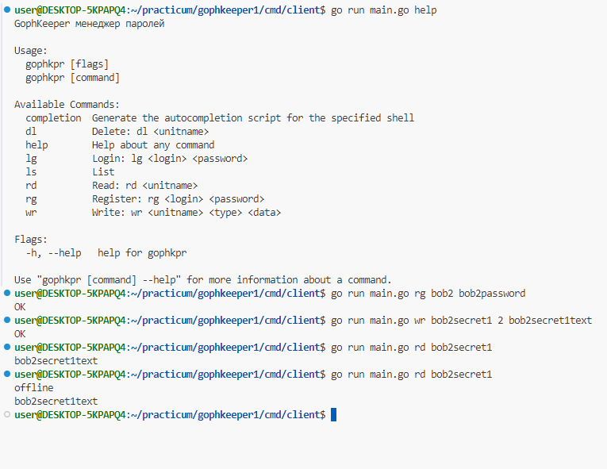

# GophKeeper
Второй учебный проект курса "Продвинутый Go-разработчик"

## Запуск сервиса
Для запуска необходимо только передать конфигурацию БД (DBDsn) при запуске сервера.
Флаг командной строки d или переменная окружения DATABASE_URI
Пример: -d "host=localhost user=bob password=bob dbname=gophkeeper sslmode=disable"

Порт для gRPC-интерфейса пока что вписан жестко

## Пример работы
Снимок работы сервиса
